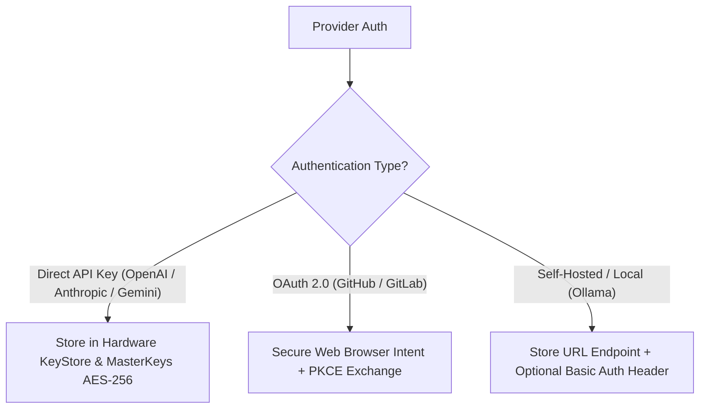

# Decision Tree: Authentication & Key Management

```mermaid
graph TD
    Start[Provider Auth] --> AuthType{Authentication Type?}
    AuthType -- Direct API Key (OpenAI / Anthropic / Gemini) --> KeyStore[Store in Hardware KeyStore & MasterKeys AES-256]
    AuthType -- OAuth 2.0 (GitHub / GitLab) --> CustomTabs[Secure Web Browser Intent + PKCE Exchange]
    AuthType -- Self-Hosted / Local (Ollama) --> EndpointOnly[Store URL Endpoint + Optional Basic Auth Header]
```

## Security Protocol
- Never log raw authorization headers or API keys.
- Mask keys in UI displays (`sk-proj-****...abc1`).
