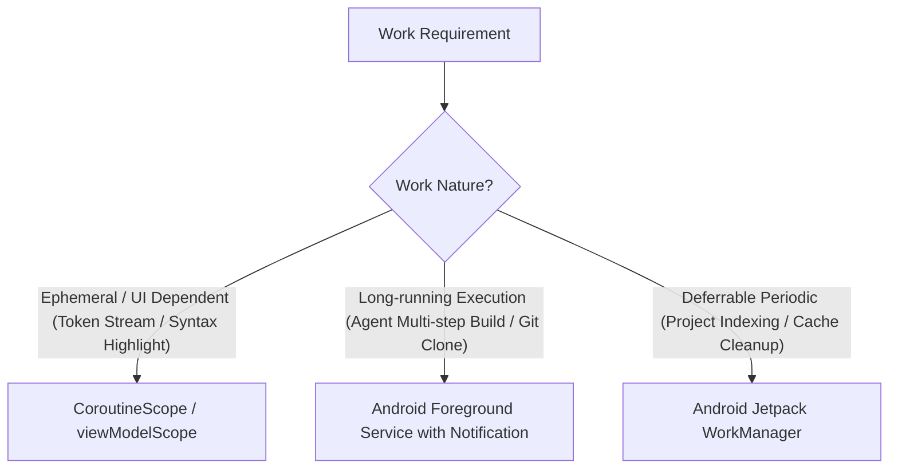

# Decision Tree: Background Work Execution

## Guidelines
- Foreground services display clear progress notifications with cancellation action buttons.
- Coroutines cancel automatically when their parent lifecycle terminates.
