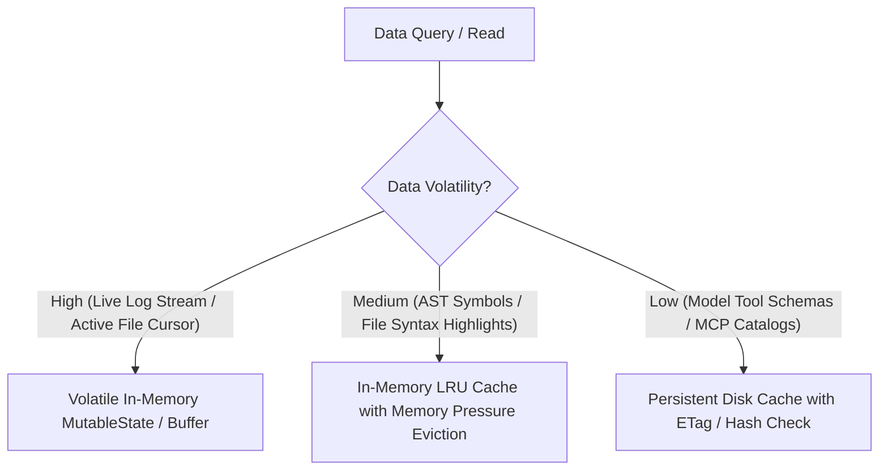

# Decision Tree: Caching Strategy

```mermaid
graph TD
    Start[Data Query / Read] --> Volatility{Data Volatility?}
    Volatility -- High (Live Log Stream / Active File Cursor) --> Memory[Volatile In-Memory MutableState / Buffer]
    Volatility -- Medium (AST Symbols / File Syntax Highlights) --> LRUCache[In-Memory LRU Cache with Memory Pressure Eviction]
    Volatility -- Low (Model Tool Schemas / MCP Catalogs) --> DiskCache[Persistent Disk Cache with ETag / Hash Check]
```

## Policy
- Listen for `ComponentCallbacks2.TRIM_MEMORY_RUNNING_CRITICAL` and purge syntax/AST caches immediately.
