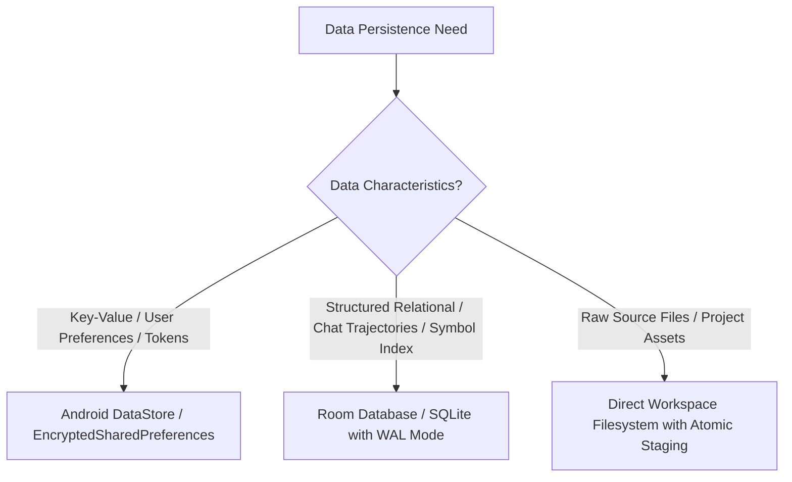

# Decision Tree: Database & Persistence Strategy

## Guidelines
- **Room**: Agent conversations, task checkpoints, symbol index, project metadata.
- **DataStore**: User settings, theme mode, model provider selections, API endpoints.
- **EncryptedSharedPreferences / KeyStore**: API keys, OAuth tokens, SSH keys.
