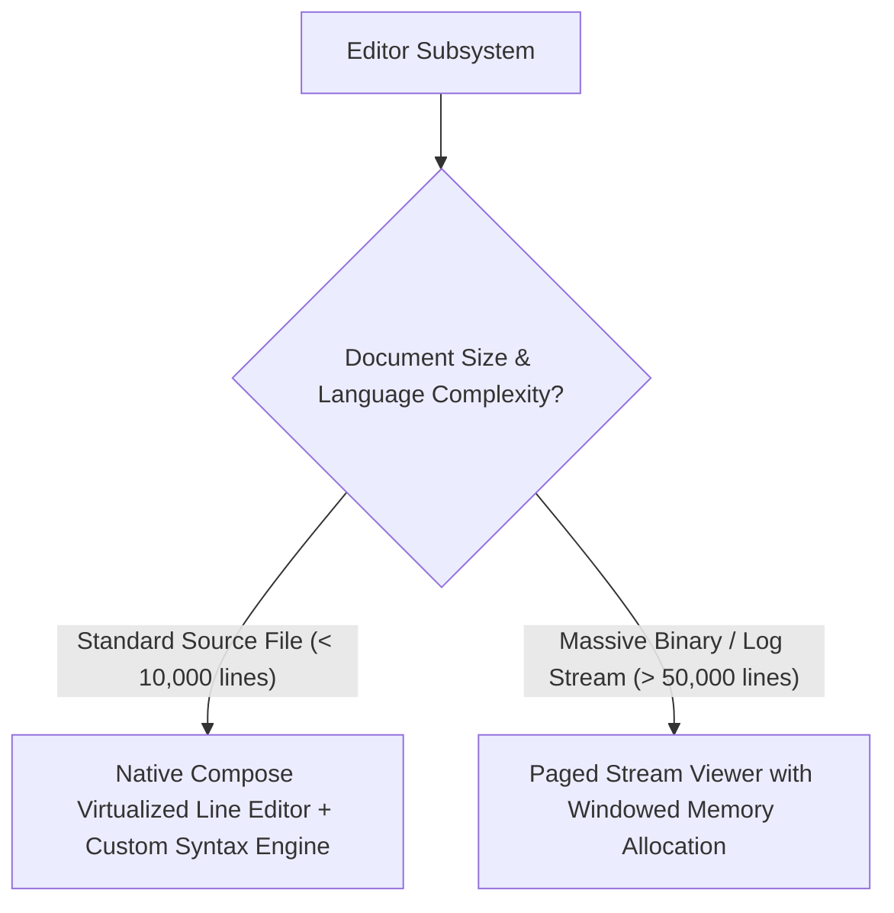

# Decision Tree: Editor Implementation

## Guidelines
- **Jetpack Compose Native**: Direct touch control, integrated keyboard accessory bar, custom magnifier loupe, instant theme switching, low memory overhead.
- **Tree-Sitter / TextMate Grammar**: Background tokenization off the main UI thread.
