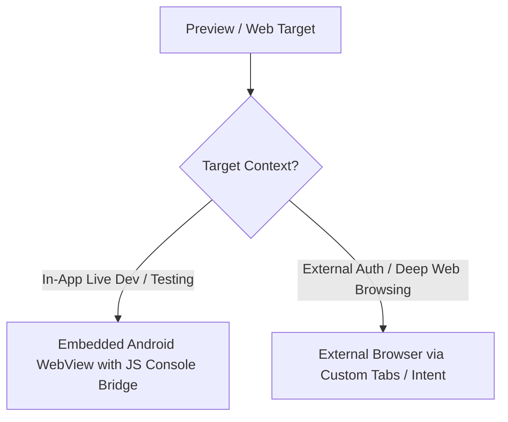

# Decision Tree: Embedded WebView vs External Browser

## Guidelines
- **Embedded WebView**: Fast live coding preview, console log streaming to IDE, multi-device viewport simulation (Mobile/Tablet/Desktop).
- **External Custom Tabs**: OAuth authentication, external documentation links, full browser testing.
