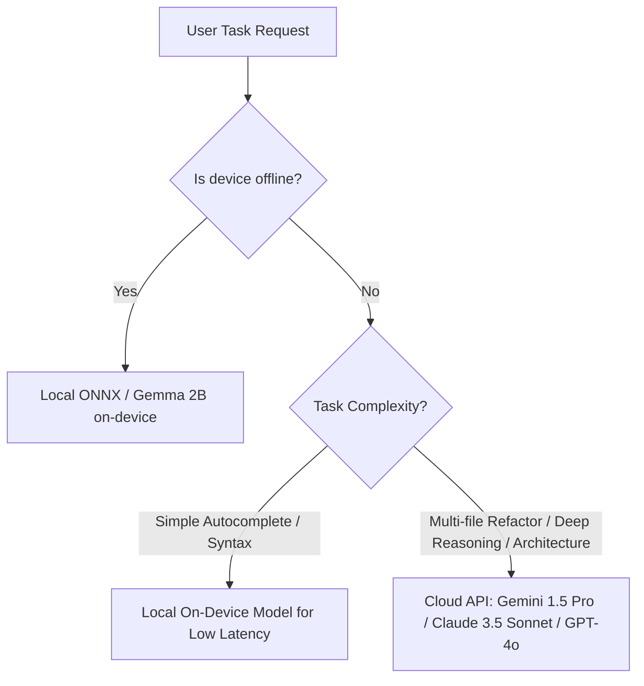

# Decision Tree: Local Model vs API Model

## Guidelines
- **Local (Gemma 2B / ONNX / ExecuTorch)**: Autocomplete, line completion, single-function doc generation, offline tasks.
- **Cloud API (Gemini / Claude / OpenAI)**: Multi-step planning, tool orchestration, deep context synthesis, multi-file code generation.
