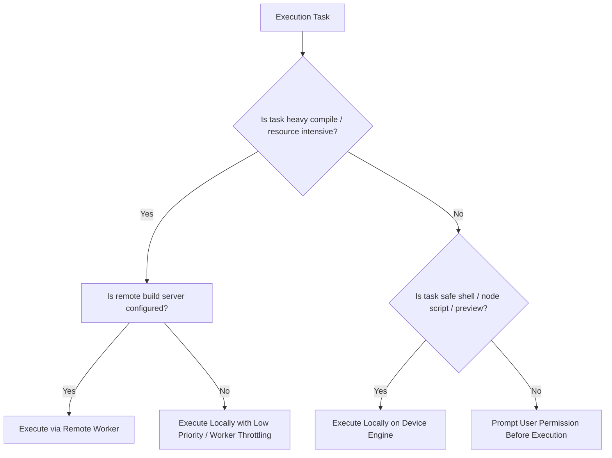

# Decision Tree: Local vs Remote Execution

## Summary
- **Local Execution**: Lightweight preview dev servers, node/js execution, local file indexing, git status, unit test runners.
- **Remote / Cloud Workers**: Heavy Android Gradle compilation, cloud Docker runners, large repository full-AST builds.
