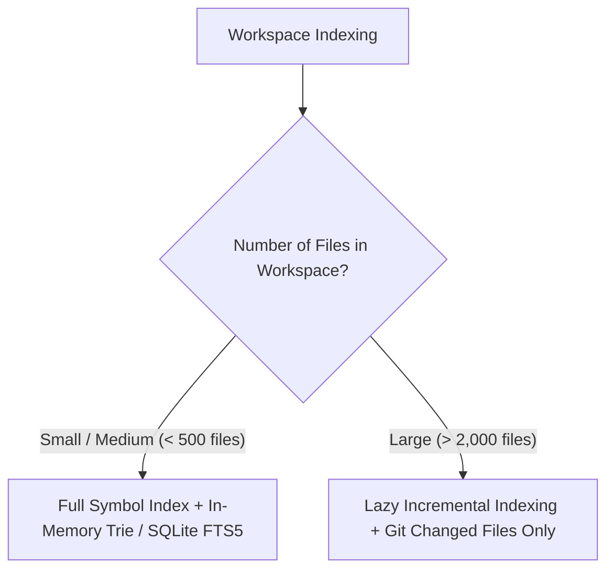

# Decision Tree: Project Indexing Strategy

## Guidelines
- **FTS5 / Trie**: Fast symbol autocomplete and fuzzy path finding.
- **Background Worker**: Indexing runs strictly at idle CPU priority and pauses when battery is low or app is backgrounded.
