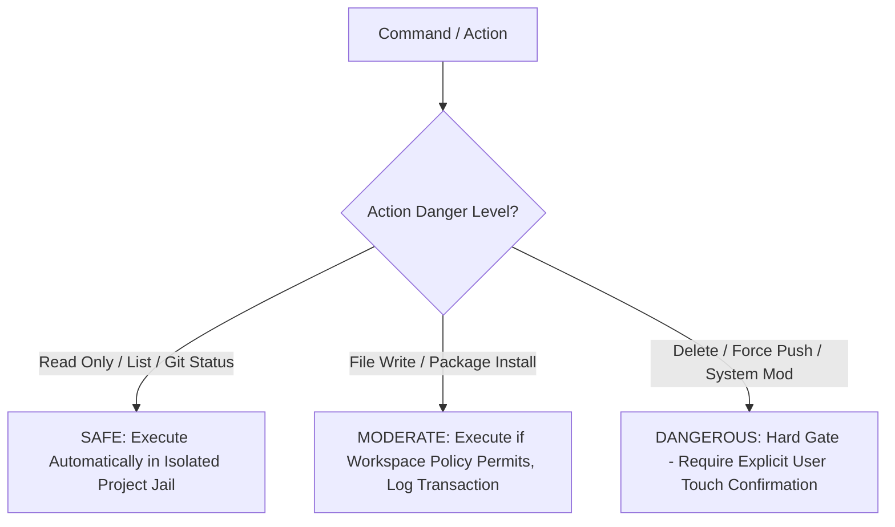

# Decision Tree: Sandbox Strategy

## Guidelines
- Strict path canonicalization prevents directory traversal attacks (`../../`).
- Atomic staging buffers allow instantaneous rollback of agent-generated modifications.
