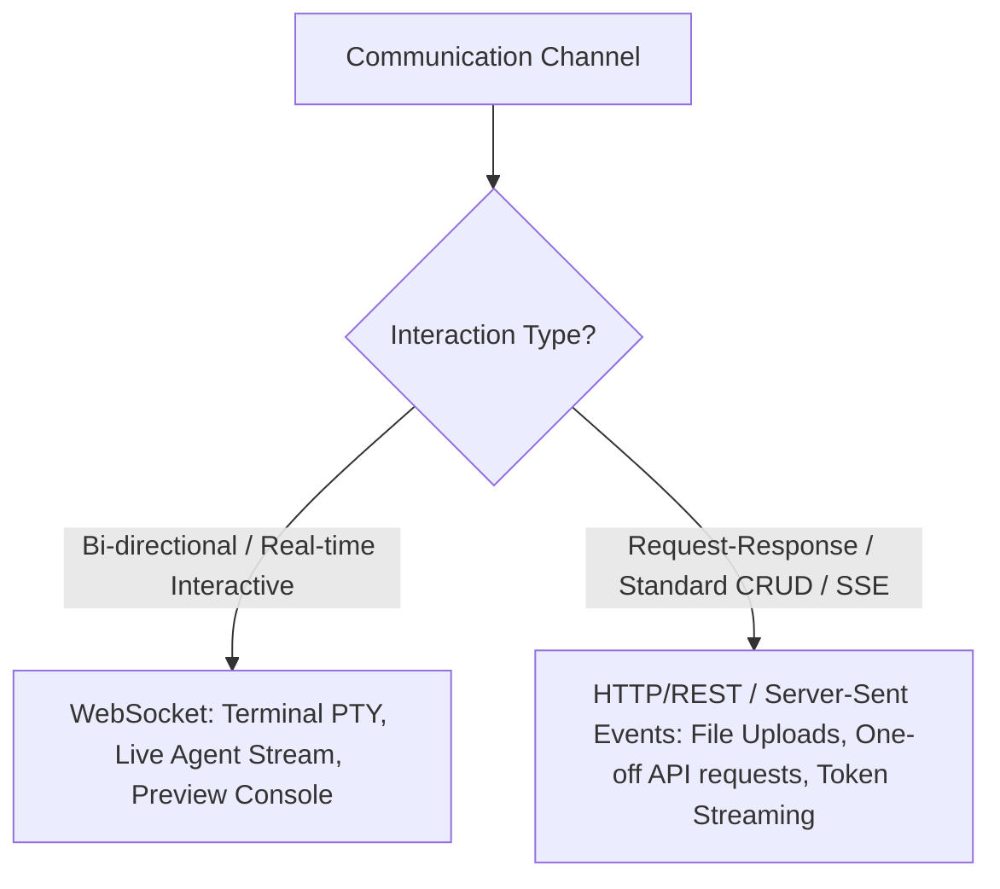

# Decision Tree: WebSocket vs HTTP

## Guidelines
- **HTTP / SSE**: LLM Token streaming (SSE `text/event-stream`), MCP SSE transport, one-off file downloads/uploads.
- **WebSocket**: Interactive PTY terminal sessions, hot-module reload signals, multi-client live sync.
