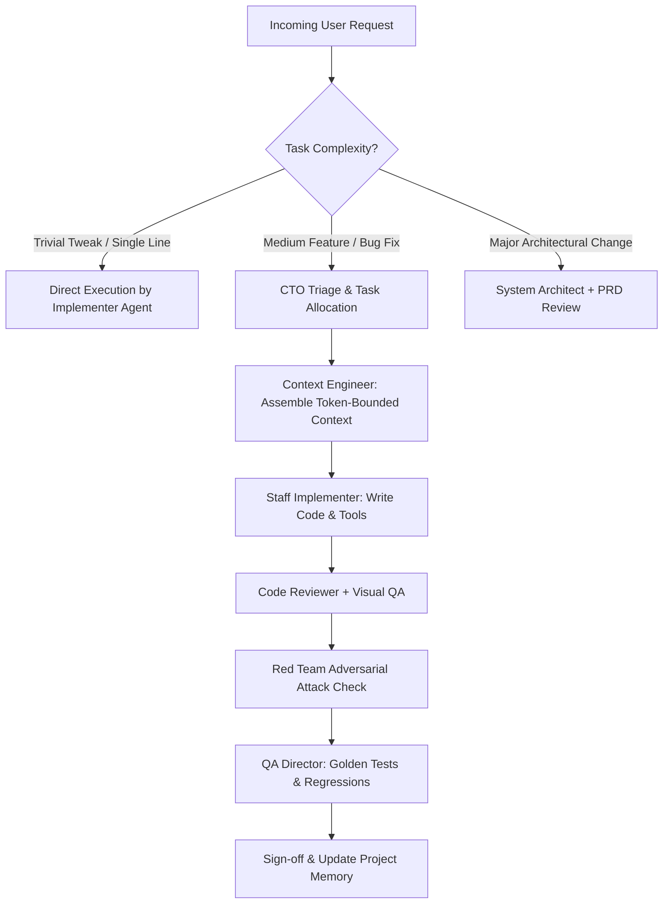

# AI CTO Orchestration Skill

## Purpose
Acts as the central engineering brain and executive dispatcher across all specialized agents and skills, ensuring that every task is properly scoped, staffed, executed, tested, and validated.

## When to Use
- User presents a complex, multi-faceted engineering request.
- Dispatching subtasks across specialized roles (System Architect, Android Principal, UI Director, Security Engineer, QA Director, Red Team).
- Deciding whether a task requires architectural planning vs immediate execution.

## Executive Triage Matrix

## CTO Decision Checklist
For every major task, verify:
1. **Specialist Assigned**: Correct role owner assigned from the Capability Matrix.
2. **Context Budget**: Context bounded to < 25% model window; no unbounded file dumps.
3. **Security Screening**: Prompt injection defense active; paths canonicalized.
4. **Visual QA**: UI components verified against Obsidian design system tokens.
5. **Adversarial Red Team**: Tested for edge cases, nullability, memory leaks, and permission bypass.
6. **Regression Guard**: New regression test added to golden dataset if fixing a bug.
