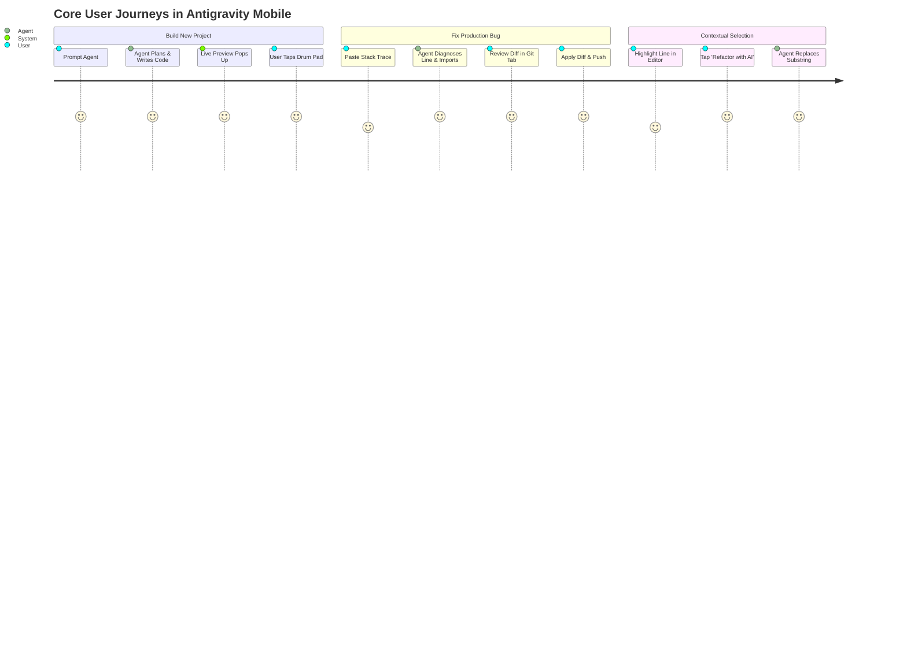

# Product Requirements Document (PRD): Antigravity Mobile

**Product Title**: Antigravity Mobile  
**Category**: AI-Native Mobile Software Engineering Studio  
**Target Platform**: Android 8.0+ (API 26+) · Optimized for Phones, Foldables & Tablets  
**Status**: APPROVED · READY FOR BUILD

---

## 1. Core Product Thesis

> **"Antigravity Mobile exists because software development on a handheld device should not mean struggling with a microscopic virtual keyboard—it should mean directing an elite, autonomous AI engineering team with your thumb."**

---

## 2. The 10 Product Principles

1. **AI-Native First, Editor Second**: The primary interaction is conversation, intent, and review; raw text typing is a secondary convenience.
2. **Thumb-Zone Centric**: 90% of high-frequency actions (prompting, diff approval, terminal run, viewport toggle) sit in the bottom 40% of the screen.
3. **Speed Over Flash**: 60/120 FPS buttery smooth transitions; zero sluggish webview wrappers for core IDE controls.
4. **Context Over Clutter**: The agent automatically perceives active file, open errors, and git diffs without the user manually attaching files.
5. **Streaming Over Waiting**: Instant token streaming with structured milestone progress cards; no opaque multi-minute loading spinners.
6. **Reviewable & Auditable**: Every single AI modification generates a readable diff with one-tap rollback.
7. **Honest Automation**: The agent never fakes command outputs, test runs, or preview servers.
8. **Restrained Obsidian Aesthetic**: Deep blacks, slate cards, subtle neon accents, and crisp JetBrains Mono typography; zero garish noise.
9. **Safe by Default**: Sandbox boundaries prevent path traversal; API keys are locked in Android KeyStore; dangerous operations require touch confirmation.
10. **Zero Friction Onboarding**: From app launch to first live previewed web app in less than 30 seconds.

---

## 3. Target Personas

### Persona A: The Indie Hacker & Vibe Coder (Alex, 28)
- **Goal**: Build full-stack web and mobile prototypes while commuting or away from desk.
- **Frustration**: Laptop is inconvenient; existing mobile IDEs require tedious typing on small keyboards.
- **Expectation**: Conversational prompt -> Autonomous multi-file creation -> Live instant preview -> One-tap Git commit.

### Persona B: The On-Call Production Engineer (Devon, 34)
- **Goal**: Triage urgent production bugs, read error traces, and deploy surgical hotfixes from phone.
- **Frustration**: Needs real Git, real terminal execution, and exact diff previews without risking repo corruption.
- **Expectation**: Deep codebase indexing, surgical diff staging, terminal execution, and sandbox security.

### Persona C: The Creative Technologist & Student (Maya, 22)
- **Goal**: Learn new frameworks, experiment with interactive generative UI, and showcase visual experiments.
- **Frustration**: Complex build toolchain setups and rigid desktop IDE learning curves.
- **Expectation**: Natural language commands, instant embedded preview with console logging, and immediate visual feedback.

---

## 4. The Magic Moment

> **The 30-Second Triumph**:
> The user opens the app on a phone, types: *"Build a cyberpunk music sampler with 4 drum pads and a visual waveform."*  
> The agent states its plan, creates `index.html` and `app.js`, automatically launches the local preview dev server, and opens the live interactive sampler. The user taps the drum pads directly on their phone screen with sound and haptics.  
> **Reaction**: *"I just coded a working synthesizer on my phone in 30 seconds without writing boilerplate."*

---

## 5. Core User Journeys

---

## 6. Information Architecture & Navigation

We use a **Hybrid Ergonomic Model**:
1. **Bottom Action Bar**: 5 Core Hubs (`Agent`, `Editor`, `Preview`, `Terminal`, `Git`).
2. **Top Project Bar**: Project Switcher, Status Banner, and Left-Edge Drawer Toggle.
3. **Left Sliding Drawer**: Recursive Workspace File Tree with file icon badges.
4. **Bottom Sheet Overlays**: Interactive Diff Approvals and Permission Confirmation Dialogs.
5. **Floating Command Palette**: Quick-access global launcher triggered via two-finger tap or search icon.

---

## 7. Screen & Viewport Inventory

1. **Agent Studio Screen**: Conversation stream, milestone plan tree, active tool status, prompt input bar.
2. **Virtualized Code Editor**: Line numbers, syntax highlighting, basic text field, and symbol accessory bar.
3. **Live Preview Screen**: Android WebView viewport (Mobile, Tablet, Full), reload button, and JS console inspector.
4. **Terminal Screen**: ANSI 256-color log stream, command input bar, and quick action chips (`npm test`, `git status`).
5. **Git Diff Review Screen**: Unified & split diff views, line additions/deletions counter, Apply/Discard actions.
6. **File Tree Drawer**: Project directory tree with add/delete file triggers.
7. **Permission Dialog**: Tiered security confirmation (SAFE / MODERATE / DANGEROUS).
8. **Settings Screen**: AI model selector (Gemini / Claude / OpenAI / Local), API Key vault, theme mode, autonomy slider.

---

## 8. Mobile UX & Ergonomics

- **Bottom Thumb Zone**: All input bars and primary confirm buttons remain within easy one-handed thumb reach.
- **Keyboard Accessory Bar**: Persistent 44dp bar above the keyboard with developer symbols: `{ } [ ] ( ) ; : < > = + - * / \ $ -> " ' # @ ! ?`.
- **Zero Layout Jump**: Smooth `WindowInsets.ime` animations without screen flicker.
- **Haptic Confirmations**: Subtle haptics on diff application, command completion, and tool approvals.

---

## 9. Feature Prioritization Matrix

| Feature | Priority | Target Milestone | Description |
| :--- | :---: | :---: | :--- |
| **Agent State Machine & Streaming** | **P0** | MVP | Deterministic state machine with streaming event flow |
| **Sandboxed Tool Registry** | **P0** | MVP | `read_file`, `write_file`, `replace_file`, `list_dir`, `grep`, `run_cmd` |
| **Obsidian Dark Theme & Compose Tokens** | **P0** | MVP | Complete Material 3 token implementation |
| **Virtualized Code Editor** | **P0** | MVP | 60 FPS line virtualization and symbol accessory bar |
| **Live Embedded Web Preview** | **P0** | MVP | Sandboxed WebView with JS console log bridge |
| **Visual Git Diff Viewer** | **P0** | MVP | Line-by-line colored diffs with one-tap apply/discard |
| **Prompt Injection Defense** | **P0** | MVP | Passive `<untrusted_workspace_file>` data enclosures |
| **PTY Terminal & ANSI Color Parser**| **P1** | Core | Real process spawning with color sequence rendering |
| **Multi-Model Provider Switcher** | **P1** | Core | Gemini 1.5 Pro, Claude 3.5 Sonnet, GPT-4o, Local Gemma |
| **Mobile Command Palette** | **P1** | Core | Fast action fuzzy launcher |
| **On-Device Gemma 2B Inference** | **P2** | Polish | Offline code completion and syntax correction |
| **Multi-Session Project Switcher** | **P2** | Polish | Manage multiple concurrent git repos on device |
